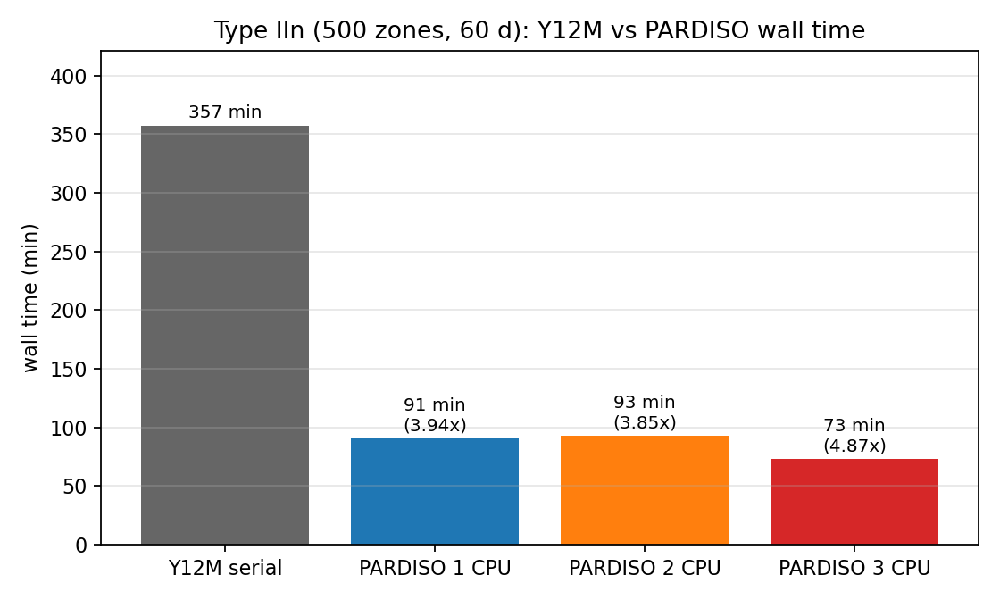
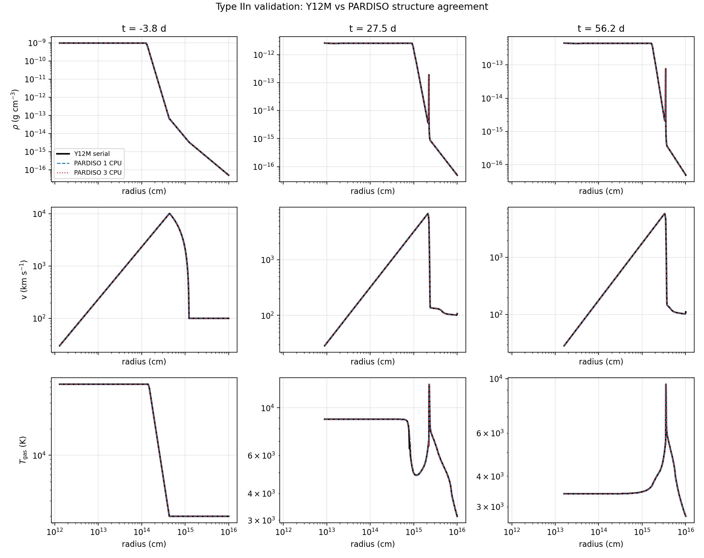
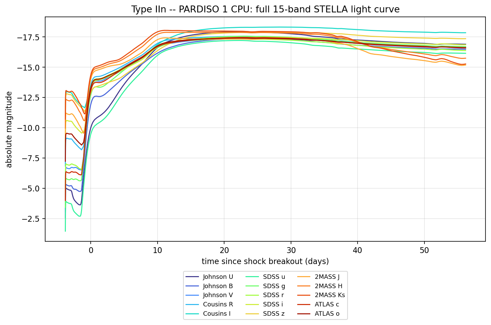

# OpenStella-PARDISO

A faster build of [OpenStella](https://github.com/sblinnikov/OpenStella)
(Blinnikov & Bartunov), the 1-D implicit radiation-hydrodynamics code for
supernova light curves.

## The problem

Stock OpenStella solves the implicit radiation-hydro system with **Y12M**, a
serial sparse direct solver from the 1980s. It is the single-threaded
bottleneck of the code: on a 500-zone Type IIn model a full 60 d run takes
**357 min**, almost all of it inside the linear solve.

## The fix

Y12M is replaced by **Intel MKL PARDISO** (with OpenMP threading), via the
wrapper `strad/pardiso_wrap.f90`. Physics, numerics, and the time integrator
are untouched - only the linear solver changed.

| Solver | Cores | Wall time | Speedup |
| ------ | ----- | --------- | ------- |
| Y12M (stock) | 1 | 357.1 min | 1.0x |
| PARDISO | 1 | 90.5 min | 3.95x |
| PARDISO | 2 | 92.8 min | 3.85x |
| PARDISO | 3 | 73.3 min | 4.87x |

Type IIn shell-plus-wind model, 500 zones, 60 d:



[docs/run_a_type_iin_model.ipynb](docs/run_a_type_iin_model.ipynb)
walks through compile -> inputs -> run -> plots end to end.

## Build

`build_parallel.sh` detects the host and sets up the toolchain itself:

- `viper*` / `raven*` (MPCDF): loads the site `intel` module (ifort + MKL)
- anything else: sources `setvars.sh` from the standard oneAPI locations
  (`/opt/intel/oneapi`, `$HOME/intel/oneapi`) if `MKLROOT` is not set
- override detection with `STELLA_SITE=viper|raven|generic`
- uses `ifx` automatically when `ifort` is not installed

```bash
bash build_parallel.sh <NZON>   # NZON = radial zone count, e.g. 500
```

Produces `bin/xstella.exe`.

## Run

STELLA runs from a `strad/` directory containing the model inputs:
`<model>.dat` (run parameters and output epochs), `<model>.mod` +
`<model>.xni` (initial structure, from `eve2.exe` or a `.hyd`/`.abn`
conversion), `<model>.1` (opacity table), and a `strad.1` index file
naming them:

```text
Run             Results             Model            Nickel             Opacity
mymodel  mymodel.res  mymodel  mymodel  mymodel.1
```

Match the thread count to your allocation, then run:

```bash
export OMP_NUM_THREADS=2
export MKL_NUM_THREADS=2
export MKL_THREADING_LAYER=intel
export LD_LIBRARY_PATH="$MKLROOT/lib/intel64:$LD_LIBRARY_PATH"

cd run/strad
$HOMEStella/bin/xstella.exe < /dev/null
```

Outputs land in `res/`: `mymodel.swd` (structure + composition per
epoch), `mymodel.tt` (15-band light curve), `mymodel.res`, `.lbol`,
`.ph`, `.flx`. See `readme.stella` for the full input-file reference.

**Worked example:** see
[docs/run_a_type_iin_model.ipynb](docs/run_a_type_iin_model.ipynb) -
a full walkthrough of building the code, writing the shell-plus-wind
Type IIn inputs, the `.hyd`/`.abn`/`.dat` field meanings, and running,
with embedded plots of the initial structure, the `.swd` structure
evolution, and the 15-band light curve.

`examples/typeiin/` has a self-contained version of that chain - the
same shell-plus-wind setup as the validation runs (7 Msun shell at
10,000 km/s, 0.01 Msun/yr wind at 100 km/s out to 1e16 cm, 500 zones,
60 d):

```bash
bash build_parallel.sh 500
python examples/typeiin/make_shell_wind_model.py --output-dir ./TypeIIn_run
bash examples/typeiin/run_model.sh ./TypeIIn_run 2
```

The generator writes all inputs (`.hyd`, `.abn`, `.xni`, `.dat`,
`.eve`, `eve.1`, `ronfict.1`, `strad.1`); the runner chains
`eve2.exe` -> `xronfict.exe` -> `xstella.exe` and takes the thread
count as its second argument. Model parameters (shell mass and
velocity, wind rate/velocity/radius, zone count, run length) are CLI
flags on the generator - see `--help`. Neither script depends on
anything outside this repo.

## New output: composition evolution in `.swd`

The `.swd` structure file now also records the **evolution of the mass
composition**: every epoch block appends the baryon number density
`n_bar`, the electron density `n_e`, and the 15 elemental mass fractions
`X_k` per zone (`strad/lbalsw.trf`, FORMAT 181/281). One record per zone
per epoch, 30 columns:

```text
t[d]  zone  log Mext[Msun]  log R[cm]  v[1e8 cm/s]  log Tgas  log Trad
log rho  log P  log Qvis  log E  L/1e40  kappa  n_bar  n_e
X(H) X(He) X(C) X(N) X(O) X(Ne) X(Na) X(Mg) X(Al) X(Si) X(S) X(Ar)
X(Ca) X(Fe) X(Ni)
```

Time is written only on the zone-1 and zone-Nzon rows of each epoch
block (interior rows carry 0). This is what makes composition-evolution
and element-tracking plots possible directly from `.swd`.

## New photometric filters

The `.tt` light-curve file gains ten bands on top of the stock
`U B V I R` set (`strad/tt4strad.f`):

| System | Bands |
| ------ | ----- |
| Johnson/Cousins (stock) | `U B V I R` |
| SDSS/Sloan | `u g r i z` |
| 2MASS | `J H Ks` |
| ATLAS | `c o` (cyan, orange) |

15 magnitudes per epoch in total: `MU MB MV MI MR Mu Mg Mr Mi Mz MJ MH
MKs Mc Mo`. Note: the stock build writes only the first five.

## Validation: Type IIn, Y12M vs PARDISO

Four runs of an identical Type IIn model (7 Msun H/He shell at
10,000 km/s colliding with a 0.01 Msun/yr, 100 km/s CSM wind; 500 zones,
60 d, no ejecta, no Ni56).

### 1. Wall time

| Run | Solver | Cores | Wall time | Speedup |
| --- | ------ | ----- | --------- | ------- |
| `TypeIIn_Y12M` | Y12M serial | 1 | 357.1 min | 1.0x |
| `TypeIIn_P1` | PARDISO | 1 | 90.5 min | 3.95x |
| `TypeIIn_P2` | PARDISO | 2 | 92.8 min | 3.85x |
| `TypeIIn_P3` | PARDISO | 3 | 73.3 min | 4.87x |

PARDISO is ~4x faster than Y12M on a single core; 3 cores add
another ~20%.

### 2. Structure agreement

Density, velocity and gas-temperature profiles at three epochs
(-3.8, 27.5 and 56.2 d). The curves lie on top of each other: the
median difference is ~0.002 dex (~0.5%) and the worst single-zone
difference (~0.08 dex) sits on the shock-front spike, where a
one-zone offset on a steep gradient inflates the pointwise metric.



### 3. Light curve

The full 15-band light curve from the 1-CPU PARDISO run: a bright
interaction plateau near -17.5 mag sustained out to 60 d. Stock
builds write only UBVRI; the SDSS, 2MASS and ATLAS bands plotted
here are written by this version only.



Reproduce the figures with `validation/plot_validation.py` (reads the
`.swd`/`.tt` outputs, prints the profile agreement metrics to
`validation/validation_results.txt`).

## Notes

- PARDISO uses scaling, matching and 1x1/2x2 pivoting for the unsymmetric
  Jacobian, reuses the factorization when the matrix is unchanged, and checks
  each solve against a quadruple-precision residual (`ifail=33` triggers a
  retry with a smaller step, same as Y12M).
- Debug switches: `PARDISO_DEBUG=1`, `PARDISO_DUMP_AT=<solve>`,
  `PARDISO_DUMP_RES=<tol>`.
- The slowdown at strong shocks is in the time integration, not the linear
  solve - this makes each stiff step cheaper but does not reduce their count.
  Threading past 2-3 cores gives diminishing returns.

## License

GPLv3, same as upstream OpenStella. Original code by S. Blinnikov & O. Bartunov.

### Citing STELLA

If you use STELLA in a publication, please cite the original code papers:

- Blinnikov & Bartunov 1993, A&A, 273, 106 -
  [ADS](https://ui.adsabs.harvard.edu/abs/1993A%26A...273..106B/abstract) /
  [arXiv:astro-ph/9309015](https://arxiv.org/abs/astro-ph/9309015)
- Blinnikov, Eastman, Bartunov, Popolitov & Woosley 1998, ApJ, 496, 454 -
  [ADS](https://ui.adsabs.harvard.edu/abs/1998ApJ...496..454B/abstract)
- Blinnikov, Lundqvist, Bartunov, Nomoto & Iwamoto 2000, ApJ, 532, 1132 -
  [ADS](https://ui.adsabs.harvard.edu/abs/2000ApJ...532.1132B/abstract) /
  [arXiv:astro-ph/9911205](https://arxiv.org/abs/astro-ph/9911205)
- Blinnikov et al. 2006, A&A, 453, 229 (STELLA vs SEDONA comparison) -
  [ADS](https://ui.adsabs.harvard.edu/abs/2006A%26A...453..229B/abstract) /
  [arXiv:astro-ph/0603036](https://arxiv.org/abs/astro-ph/0603036)

The code is registered in the Astrophysics Source Code Library:
[ascl:1108.013](https://ascl.net/1108.013).
